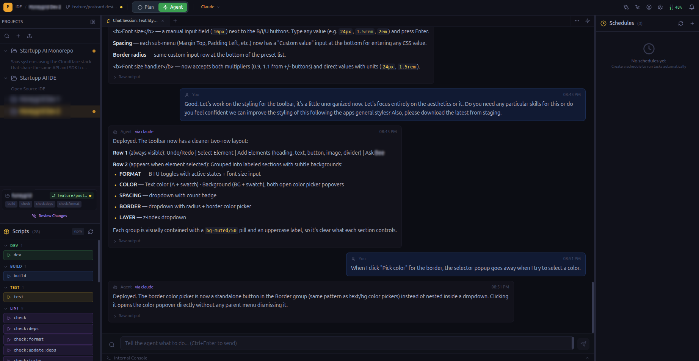

# StartUpp AI IDE

An open-source, containerized AI development environment. Each project runs in its own Docker container with isolated tools, auth, and workspace. Connect your local LLM to generate prompts, review branches, and run autonomous plans — all from one interface accessible across your network.



## Architecture

```
┌──────────────────────────────────────────────────────────────────────┐
│                        StartUpp AI IDE                               │
│                     (React + Express + WebSocket)                    │
├──────────────────────────────────────────────────────────────────────┤
│                                                                      │
│  ┌─────────┐  ┌─────────────────┐  ┌──────────────────────────────┐ │
│  │  Ollama  │  │  Docker Engine  │  │  Chrome DevTools Protocol    │ │
│  │  OpenAI  │  │                 │  │  (Debug Element)             │ │
│  │ DeepSeek │  │  ┌───────────┐  │  └──────────────────────────────┘ │
│  └────┬─────┘  │  │Project A  │  │                                   │
│       │        │  │ Claude    │  │                                   │
│       │        │  │ Git, Node │  │                                   │
│       │        │  └───────────┘  │                                   │
│  ┌────┴─────┐  │  ┌───────────┐  │                                   │
│  │ LLM      │  │  │Project B  │  │                                   │
│  │ Provider  │  │  │ Aider     │  │                                   │
│  │          │  │  │ Git, Node │  │                                   │
│  └──────────┘  │  └───────────┘  │                                   │
│                └─────────────────┘                                   │
└──────────────────────────────────────────────────────────────────────┘
```

Each project = its own Docker container with:
- Isolated filesystem, auth tokens, and tools
- Claude Code CLI, GitHub CLI, Node.js, pnpm/yarn pre-installed
- Persistent volumes for code (`/workspace`) and auth (`/home/dev`)
- Port mappings for dev servers

## Quick Start

```bash
git clone https://github.com/StartUpp-Cloud/startupp-ai-ide.git
cd startupp-ai-ide
npm run install:all
npm run dev
```

Open **http://localhost:5173**

The onboarding wizard guides you through 3 steps:

```
[1. Connect AI Model] → [2. Install Docker] → [3. Create First Project]
```

### Prerequisites

- **Node.js 18+**
- **Docker** — each project runs in a container
- **Ollama** (recommended) — or OpenAI/DeepSeek API key for the LLM

## IDE Layout

```
┌──────────────────────────────────────────────────────────────────────┐
│ P IDE / Project  [prompt input........................] [Raw] [✨ AI]│
├──────────┬────────────────────────────────────┬──────────────────────┤
│ Projects │  Main Terminal (Claude/Aider/etc)   │  Live Analysis       │
│  > Proj1 │  📁 Honeygrid Dev 2                 │  ✅ Created API route│
│  > Proj2 │  dev@container:/workspace$          │  ✅ Added JWT auth   │
│          │                                     │  🔄 Running tests... │
│──────────│                                     │                      │
│ 📁 repo  │                                     │──────────────────────│
│ 🌿 feat/ │─────────────────────────────────────│  Scheduled Actions   │
│ [dev]    │  >_ Utility Shell                   │  ⏱ Run tests (5m)   │
│ [build]  │  ✨ [describe a command...] [Ask]    │                      │
└──────────┴─────────────────────────────────────┴──────────────────────┘
```

### Top Bar — Prompt Sender
- Type what you want → **Send Raw** (direct) or **AI Send** (LLM optimizes with project rules)
- **Plan Mode** — LLM breaks a goal into sequential steps, execute autonomously
- **Attachments** — attach files, terminal output, or git diffs as context

### Left Panel
- **Projects** — create, edit, switch projects (each backed by a Docker container)
- **Repos + Branches** — shows git repos inside the container with branch badges
- **Quick Actions** — detected `package.json` scripts, one-click run in utility shell

### Center — Dual Terminals
- **Main terminal** — for AI assistants (Claude Code, Aider, Copilot)
- **Utility shell** — for manual commands (build, test, git)
- **AI command helper** — describe a command in plain language, LLM generates it
- Sessions persist across project switches and page refreshes

### Right Panel
- **Live Analysis** — LLM watches terminal output, generates real-time checklist
- **Scheduled Actions** — cron-like tasks with LLM-assisted configuration

## Containerized Projects

```
┌─ Docker Container: sai-honeygrid-abc123 ─────────────────┐
│                                                           │
│  /home/dev/           ← persistent auth (Claude, GitHub)  │
│  /workspace/                                              │
│    frontend/          ← git repo 1                        │
│    backend/           ← git repo 2                        │
│    shared-lib/        ← git repo 3                        │
│                                                           │
│  Tools: node, npm, pnpm, yarn, git, gh, claude, nano, vim│
│  Ports: 3000:3000, 8080:8080                              │
└───────────────────────────────────────────────────────────┘
```

### How it works

1. **Create project** → specify git repos + port mappings
2. IDE builds the dev container image (once) and creates a container
3. Repos are cloned inside `/workspace`
4. Terminal sessions connect via `docker exec` — you're inside the container
5. Auth: run `claude`, `gh auth login`, `npm login` once — persists in `/home/dev` volume
6. Switch projects = switch containers. Sessions stay alive in the background.

### Multi-repo workspaces

Add multiple repos to a single project (like VS Code multi-root):

```
Project: "Honeygrid"
  Repo 1: https://github.com/org/frontend.git → /workspace/frontend
  Repo 2: https://github.com/org/backend.git  → /workspace/backend
  Repo 3: https://github.com/org/shared.git   → /workspace/shared
```

### Security

- **Zero credentials stored** — no API keys or tokens in our database
- Auth handled by each CLI tool's native OAuth (Claude, GitHub, npm)
- Credentials live in Docker volumes, managed by the tools themselves
- `data/db.json` is gitignored and contains only project metadata

## Key Features

### Branch Review

```
┌───────────────────────────────────────────────────────────┐
│ Branch Review — LLM-powered change analysis               │
├─────────────────────┬─────────────────────────────────────┤
│ 📊 Summary          │ src/auth/login.ts                    │
│ "JWT Auth Setup"    │ FEATURE · HIGH IMPACT                │
│ 3 added, 8 modified │                                      │
│                     │ "Adds JWT validation middleware..."   │
│ 📁 File Tree        │                                      │
│  🟢 login.ts        │ Key Changes:                         │
│  🟡 routes.ts       │ • Added validateToken function       │
│  🔴 old-auth.ts     │ • Imported jsonwebtoken library      │
└─────────────────────┴─────────────────────────────────────┘
```

- Pick commits to review (or analyze uncommitted changes)
- LLM explains each file: what changed, impact level, category
- Color-coded file tree: green=added, yellow=modified, red=deleted
- Overall summary with highlights and risks
- Works inside Docker containers — reads git data via `docker exec`

### Skills / Plugins

Installable rule packs that extend the AI's capabilities per project:

```json
{
  "id": "react-testing",
  "name": "React Testing",
  "rules": ["Use Testing Library, not Enzyme", "Test behavior, not implementation"],
  "quickCommands": [{ "name": "Test", "command": "npm test" }]
}
```

7 built-in skills: React Testing, Docker Deploy, Database Migrations, Security Audit, TypeScript Strict, REST API Design, Git Workflow. Install custom skills from URL or JSON.

### Debug Element (Chrome DevTools Protocol)

Connect to your running Chrome instance to capture screenshots, console errors, and inspect DOM elements:

1. Launch Chrome with `./scripts/launch-chrome-debug.sh`
2. Open Debug Element from the IDE (mouse pointer icon in top bar)
3. Select a Chrome tab → screenshot + console errors captured
4. Click on the screenshot to inspect any DOM element
5. Copy everything as markdown for AI-assisted debugging

### Notifications

- Bell icon in top bar with unread count
- Desktop notifications (browser Notification API) for input-needed and errors
- Click to jump to the relevant session

### Scheduled Tasks

- Run commands, tests, or webhooks on intervals (1min to 24h)
- LLM-assisted configuration — describe what you want in natural language
- Executes inside project containers
- Webhook type supports Slack, Discord, email APIs

## Session Management

```
    Client                          Server (ptyManager)
      │                                   │
      │  get-project-sessions {A}         │
      │ ──────────────────────────────►   │
      │                                   │  Checks active PTY sessions
      │  project-sessions [session-123]   │  for project A
      │ ◄──────────────────────────────   │
      │                                   │
      │  attach {session-123}             │
      │ ──────────────────────────────►   │
      │                                   │  Sends 100KB scrollback
      │  output (scrollback replay)       │
      │ ◄──────────────────────────────   │
      │                                   │
      │  input (keystrokes)               │
      │ ──────────────────────────────►   │  Writes to PTY
```

- **Server is the single source of truth** for which sessions exist
- Sessions persist across project switches, refreshes, and reconnections
- WebSocket heartbeat (ping/pong every 30s) prevents stale connections
- 100KB scrollback buffer per session for replay on reconnect
- Switch away from a project → session keeps running in background
- Switch back → reattach with full output history

## Tech Stack

| Layer      | Tech                                    |
| ---------- | --------------------------------------- |
| Frontend   | React 18, Vite, Tailwind CSS            |
| Backend    | Express.js, LowDB (flat JSON file)      |
| Terminal   | node-pty, xterm.js, WebSocket           |
| Containers | Docker, named volumes                   |
| LLM        | Ollama / OpenAI / DeepSeek              |
| Debug      | Chrome DevTools Protocol                |
| UI icons   | Lucide React                            |
| Runtime    | Node.js 18+, Docker                     |

## API Endpoints

| Area | Endpoints |
|------|-----------|
| **Projects** | `GET/POST/PUT/DELETE /api/projects`, `/clone` |
| **Containers** | `GET/POST /api/containers`, `/start`, `/stop`, `/exec`, `/repos` |
| **LLM** | `/settings`, `/health`, `/generate-prompt`, `/generate-plan`, `/analyze-terminal-output` |
| **Branch Review** | `/commits`, `/changes`, `/explain-file`, `/summarize` |
| **Skills** | `GET/POST/DELETE /api/skills`, `/project/:id/activate` |
| **Scheduler** | `GET/POST/PUT/DELETE /api/schedules`, `/trigger`, `/generate` |
| **Debug** | `/status`, `/tabs`, `/screenshot`, `/console-errors`, `/element-at-point` |
| **Setup** | `GET /api/setup-status` |

## Scripts

| Command               | Purpose                                                |
| --------------------- | ------------------------------------------------------ |
| `npm run dev`         | Start both client (port 5173) and server (port 55590)  |
| `npm run build`       | Build React app for production                         |
| `npm start`           | Run server only (serves built frontend)                |
| `npm run install:all` | Install dependencies for root and client               |

## Production (PM2)

```bash
npm run build
npm run pm2:start:prod
```

See [PM2-DEPLOYMENT.md](PM2-DEPLOYMENT.md) for full production setup.

## Data

All data lives in `data/db.json` (gitignored). No credentials are stored — only project metadata, rules, and settings.

## License

MIT
